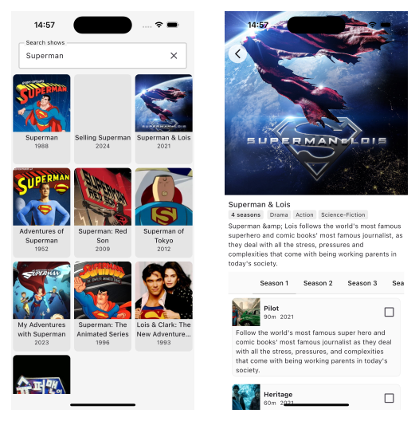

# Cha-Flix

A Kotlin Multiplatform (KMP) application built with Jetpack Compose for Android and iOS, following Clean Architecture principles. This app allows users to search and browse TV shows using the TVMaze API.

## 🚀 Features

- **Cross-platform**: Runs on both Android and iOS
- **Modern UI**: Built with Jetpack Compose Multiplatform
- **Clean Architecture**: Well-structured codebase following SOLID principles
- **Dependency Injection**: Using Koin for dependency management
- **Navigation**: Voyager navigation library for smooth screen transitions
- **Image Loading**: Coil for efficient image loading and caching
- **Network**: Ktor client for API communication
- **Data Persistence**: Local preferences storage

## 📱 Screenshots



## 🏗️ Architecture

This project follows **Clean Architecture** principles with clear separation of concerns:

### Project Structure

```
cha-flix/
├── composeApp/          # UI Layer (Android & iOS)
│   ├── src/
│   │   ├── androidMain/ # Android-specific UI
│   │   ├── iosMain/     # iOS-specific UI
│   │   └── commonMain/  # Shared UI components
│   └── build.gradle.kts
├── shared/              # Business Logic Layer
│   ├── src/
│   │   ├── commonMain/  # Shared business logic
│   │   ├── androidMain/ # Android-specific implementations
│   │   └── iosMain/     # iOS-specific implementations
│   └── build.gradle.kts
└── iosApp/              # iOS App Wrapper
```

### Clean Architecture Layers

#### 1. **Presentation Layer** (`composeApp/`)
- **Screens**: UI screens and ViewModels
- **Components**: Reusable UI components
- **DI**: App-level dependency injection setup

#### 2. **Domain Layer** (`shared/infra/domain/`)
- **Models**: Business entities (`Show`, `Episode`, `Season`, `Image`)
- **Repositories**: Abstract repository interfaces
- **Use Cases**: Business logic implementation
  - `GetShowsUseCase`: Search for TV shows
  - `GetSeasonsUseCase`: Get show seasons
  - `MarkEpisodeWatchedUseCase`: Mark episodes as watched

#### 3. **Data Layer** (`shared/data/`)
- **DTOs**: Data Transfer Objects for API responses
- **Mappers**: Convert between DTOs and domain models
- **Repositories**: Concrete repository implementations
- **Remote**: API service implementations
- **Local**: Local data storage

#### 4. **Infrastructure Layer** (`shared/infra/`)
- **Network**: HTTP client configuration
- **Settings**: Platform-specific settings management

## 🛠️ Tech Stack

### Core Technologies
- **Kotlin Multiplatform**: 2.2.0
- **Jetpack Compose Multiplatform**: 1.8.2
- **Kotlin Serialization**: 2.2.0

### Dependencies

#### UI & Navigation
- **Compose Multiplatform**: Modern declarative UI
- **Voyager**: Type-safe navigation library
- **Material Icons**: Extended icon set
- **Coil**: Image loading and caching

#### Dependency Injection
- **Koin**: 4.1.0 - Lightweight DI framework

#### Network
- **Ktor Client**: 3.1.3 - HTTP client
- **Kotlinx Serialization**: JSON serialization

#### Testing
- **Kotlin Test**: Unit testing
- **AndroidX Test**: Android instrumentation testing

#### Platform-Specific
- **Android**: Activity Compose, Lifecycle Runtime Compose
- **iOS**: Darwin HTTP client

## 🚀 How to Run

### Prerequisites

- **Android Studio**: Arctic Fox or later
- **Xcode**: 14.0 or later (for iOS)
- **JDK**: 21 or later
- **Kotlin**: 2.2.0
- **Gradle**: 8.9.3

### Android Setup

1. **Clone the repository**
   ```bash
   git clone <repository-url>
   cd cha-flix
   ```

2. **Open in Android Studio**
   - Open Android Studio
   - Select "Open an existing project"
   - Navigate to the `cha-flix` folder
   - Click "OK"

3. **Sync the project**
   - Android Studio will automatically sync the project
   - Wait for the sync to complete

4. **Run on Android**
   - Select an Android device or emulator
   - Click the "Run" button (▶️) or press `Shift + F10`
   - The app will build and install on your device

### iOS Setup

1. **Build the shared framework**
   ```bash
   ./gradlew :shared:assembleXCFramework
   ```

2. **Open in Xcode**
   - Navigate to `iosApp/iosApp.xcodeproj`
   - Open the project in Xcode

3. **Configure signing**
   - Select your development team in Xcode
   - Update bundle identifier if needed

4. **Run on iOS**
   - Select an iOS simulator or device
   - Click the "Run" button (▶️) or press `Cmd + R`

### Command Line Build

#### Android
```bash
./gradlew :composeApp:assembleDebug
```

#### iOS
```bash
./gradlew :shared:assembleXCFramework
```

## 📁 Project Modules

### `composeApp` Module
- **Purpose**: UI layer for both Android and iOS
- **Contains**: Screens, ViewModels, UI components, navigation
- **Dependencies**: `shared` module, Compose libraries

### `shared` Module
- **Purpose**: Business logic and data layer
- **Contains**: Domain models, use cases, repositories, API clients
- **Dependencies**: Koin, Ktor, Kotlinx Serialization

### `iosApp` Module
- **Purpose**: iOS app wrapper
- **Contains**: iOS-specific configuration and app entry point

## 🔧 Configuration

### Android Configuration
- **Min SDK**: 24 (Android 7.0)
- **Target SDK**: 35
- **Compile SDK**: 35
- **Namespace**: `com.jetbrains.kmpapp`

### iOS Configuration
- **Deployment Target**: iOS 14.0+
- **Framework**: `sharedKit.framework`

## 🧪 Testing

### Run Tests
```bash
# Run all tests
./gradlew test

# Run Android tests
./gradlew :composeApp:testDebugUnitTest

# Run shared module tests
./gradlew :shared:testDebugUnitTest
```

## 📚 API Integration

This app integrates with the **TVMaze API** to fetch TV show data:
- **Base URL**: `https://api.tvmaze.com`
- **Endpoints**: Search shows, get show details, episodes, and seasons
- **Rate Limiting**: Respects API rate limits

## 🤝 Contributing

1. Fork the repository
2. Create a feature branch (`git checkout -b feature/amazing-feature`)
3. Commit your changes (`git commit -m 'Add some amazing feature'`)
4. Push to the branch (`git push origin feature/amazing-feature`)
5. Open a Pull Request

## 📄 License

This project is licensed under the MIT License - see the [LICENSE](LICENSE) file for details.

## 🙏 Acknowledgments

- [TVMaze API](https://www.tvmaze.com/api) for providing TV show data
- [JetBrains](https://www.jetbrains.com/) for Kotlin Multiplatform
- [Compose Multiplatform](https://www.jetbrains.com/lp/compose-multiplatform/) team
- [Koin](https://insert-koin.io/) for dependency injection
- [Voyager](https://github.com/adrielcafe/voyager) for navigation
